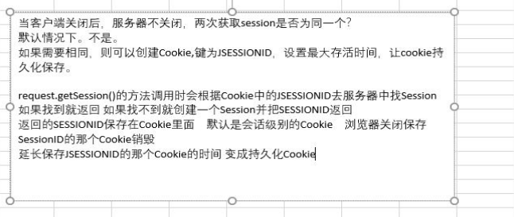

1. 四种会话跟踪技术
	* Cookie
	* Session
	* URL重写
	* 隐藏表单域

2. 会话:
	生命周期: 当用户进入到网站, 会话开启, 直到浏览器关闭, 会话结束
	与请求关系: 一次会话, 可以有多次请求.

3. Cookie分类
	1. 会话级别的 Cookie
		* 
	2. 持久级别的 Cookie
		* setMaxAge()
		* 一个星期: setMaxAge(60 * 60 * 24 * 7)
		* 在存活时间内如果访问了网站或者使用了 Cookie , 计数重新开始
		* 删除 Cookie: setMaxAge(0)
4. Cookie中不建议存中文, 也很少存中文
	* 手动编解码.
5. Cookie 存储中的 name 若是相同, 则对应的 value 会被后续存储的覆盖.
6. 遍历 Cookie 的工具类
```java
public Cookie findCookie(Cookie[], cookieName){
	遍历数组, 对比每一 cookie 的名称和传进来的 name 是否一致
	如果一致, 返回该 cookie 没有返回null
}
if (cookie != null){
	
} else {

}
```
7. 当客户端关闭后，服务器不关闭，两次获取session是否为同一个？
			* 默认情况下。不是。
			* 如果需要相同，则可以创建Cookie,键为JSESSIONID，设置最大存活时间，让cookie持久化保存。
				 Cookie c = new Cookie("JSESSIONID",session.getId());
		         c.setMaxAge(60*60);
		         response.addCookie(c);
				 
8. [面试]3. session什么时候被销毁？
			1. 服务器非正常关闭时
				* 浏览器关闭时: 没有被销毁, 只是保存 sessionID 的cookie 被销毁, 
				* Session 在服务器中成为垃圾对象, 没有引用指向该Session, 超过默认时间自动销毁.
			2. session对象调用invalidate() 。
				* session.removeAttribute(String name)
			3. session默认失效时间 30分钟
				选择性配置修改	
				<session-config>
			        <session-timeout>30</session-timeout>
			    </session-config>
9. 
## [归纳] 常见编解码
	1. URLEncoder <--> URLDecoder
	2. Base64
	3. MD5 --> 不可逆
	4. DES
	5. AES
	6. 3DES
	7. AES
	8. RSA
	9. SHA1
	10. SM1---SM4
## 域对象区别
		request			ServletContext			Session
作用范围: 一次请求			项目周期				一次会话
生命周期:										当调用了 getSession() 方法,创建	
												三种方式销毁
 
 Session 的保存依赖于 Cookie: cookie("set")